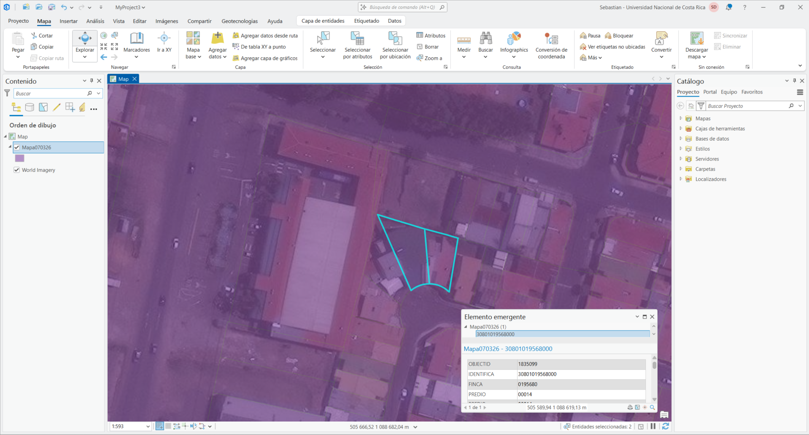

# Sistemas de Información Geográfica
## Introducción

En esta página encontrará un repositorio de **información general** sobre lo que son los *Sistemas de Información Geográfica* (en adelante "SIG"), sus características principales, algunos ejemplos, aplicaciones y otros.

El **objetivo principal** de esta iniciativa es **dar a conocer**, en un lengua simple y para aprovechamiento general, **el maravilloso mundo de los SIG**.

## Definición

Los *Sistemas de Información Geográfica*, conocidos con el acrónimo **SIG** o _**GIS**_ (al hacer referencia a *Geograpich Information Systems*, en inglés), pueden definirse de varias maneras. Algunos autores han publicado definiciones simples, otros más elaboradas, algunos generalistas y otros específicos, sin embargo, la mayor parte de estas definiciones siguen una estructura cómun formada por **tres partes**: 

- Componentes.
- Capacidades.
- Referencia al uso de la ubicación / referencia.
  
 \
Por tanto, podríamos **definir** a un _**Sistema de Información Geográfica**_ como:

>"Un SIG es un sistema formado por una parte física computacional (Hardware), un programa informático (Software), un conjunto de  información (Datos) y una serie de acciones conjuntas (Flujos de trabajo) que habilitan ciertas capacidades como crear, recoger, guardar de forma organizada, editar, visualizar, comunicar y analizar datos, tomando en cuenta su ubicación en un sistema de referencia común (georreferenciados), para tomar mejores decisiones y/o publicitar resultados en formas de mapas y/o aplicaciones." — Sebastián Damazzio Fernández.

**Figura 1. Software SIG ArcGIS Pro**. Fuente: *Elaboración Propia.*

## Inicios

Históricamente los **SIG** han permitido avanzar en conjunto a los áreas y disciplinas como la **Cartografía** y la **Informática**. Sin embargo, fué en los años 60's, dónde se dan los grandes avances tecnológicos y los Sistemas de Información Geográfica da seguimiento a esos temas.

Se dice que el primer profesional relacionado con los **SIG** que utilizó dicho término fué el señor Roger Tomlinson, un destacado geógrafo inglés que utilizó el término _*Sistemas de Información Geográfica*_ en los años 60's, al dirigir un proyecto de invetario de tierras para Canadá, puesto que le valió el sobrenombre de **"El padre del SIG"**.

## ¿Para qué sirve un SIG?

Con los **SIG** es posible realizar una gran cantidad operaciones relacionadas principalmente con la ubicación, tales como:

1. Generar mapas interactivos
2. Ayudar a planificar un trabajo de campo 
3. Crear, mantener y publicitar el Catastro
4. Muchos otros más.

_Con un **SIG** es posible ahorrar recursos de tiempo y dinero, realizar procesos de forma digital, mejorar los tiempos de viaje, reducir labores repetitivas, reopilar datos en campo, analizar situaciones anómalas para informar a los encargadaos y principalmente generar **Entregables** al cliente de mayor calidad e información._

También con un **SIG** es posible generar aplicaciones y productos de información geográfica en campos tan diversos como: Ingeniería, Geografía, Telecomunicaciones, Conservación de Recursos Naturales, Salud, Agricultura, Seguridad Pública, Catastro, Ordenamiento Territorial entre muchas más.

## Sistemas de Referencia

### Ubicación

Los **sistemas de referencia** son fundamentales para la correctar operación de un SIG, ya que todo proyecto SIG tiene un sistema de coordenadas definido.

Los **SIG** utilizan ubicaciones absolutas en lugar de relativas, eso quiere decir que la forma de expresar o dejar constancia de la ubicación de un lugar, es irrepetive en el territorio, y las ubicaciones normalmente se representan en un par de coordenadas que están escritas en un idioma informático de conocimiento común.

### Sistemas de Coordenadas

#### Sistemas de Coordenadas Geográfica (3D)

Entendemos por **Sistemas de Coordenadas Geográficas** una serie de elementos matemáticos que definen y hacen posible la representación de la tierra o una parte de ella en un software de computadora en forma de mapas.

#### Sistemas de Coordenadas Proyectadas  (2D)

Entendemos por **Sistemas de Coordenadas Proyectadas** una serie de elementos matemáticos, basados en un **Sistema de Coordenadas Geográficas 3D** que definen y hacen posible la representación de la tierra o una parte de ella en un software de computadora en forma de **mapas 2D.**

## Sistemas Oficiales en Costa Rica

En Costa Rica el Sistemas de Coordenadas XY oficial es el Sistema **CR-SIRGAS CRTM05**.

En el pasado otros sitemas utilizados (y de los cuáles aún hay mucha información) son **CR-05CRTM05, Lambert Norte, Lambert Sur y Coordenadas UTM**.

## Datos en SIG

### Modelo SIG

Los Sistemas de Información Geográfica Utilizan un modelado de la realidad para representar la Tierra en Capas.

**Figura 2. Modelo de Información SIG**. Fuente: *Esri.*

Para la representación de elementos, los SIG utilizan una entidad acompañada de uno o más atributos, que corresponde al componente literal de la representación espacial (georreferenciada)

### Tipos de datos

Existen varias clasificación posible para los datos que se utilizan en un SIG, sin embargo de las más importantes es la distinción por el tipo de geometría a utilizar. Según esto existen:

- Datos tipo Vector.
- Datos tipo Ráster.

### Datos Vectoriales

Geometría que utiliza puntos, líneas y/o polígonos para los objetos del mundo real que representa y que tienen muy claras y definidas sus formas y/o fronteras. Planos, Árboles, Negocios, Líneas del Ferrocarril, etc.

### Datos Ráster

R/Geometría que utiliza celdas de igual tamaño en líneas y columnas (cuadrícula) para representar objetos del mundo real que representa y que no tienen tan claras y definidas sus formas y/o fronteras. P.e. Incendios, Modelos de Elevación, Ortofotos, etc.

**Figura 3. De Ráster a Vector**. Fuente: *Esri.*

Más información: 
(https://www.esri.com/en-us/what-is-gis/overview)

